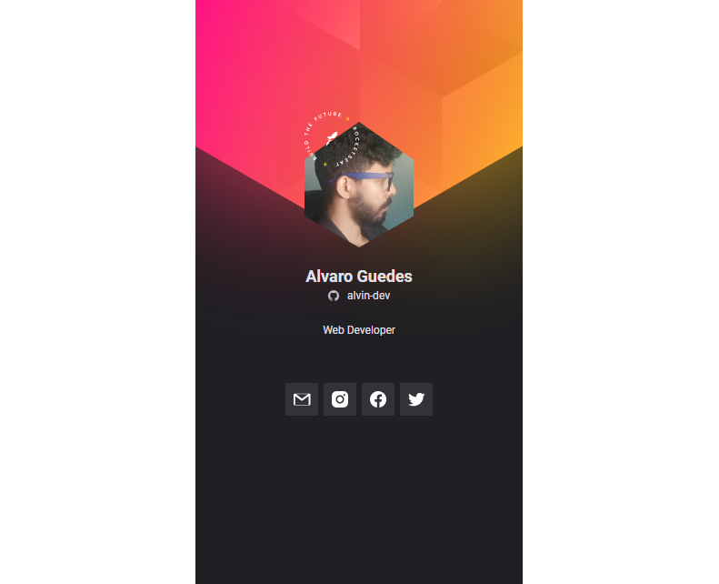

<h1 align="center">Crachá Virtual DoWhile 2021</h1>

<a href="#-tecnologias">Tecnologias</a>&nbsp;&nbsp;&nbsp;|&nbsp;&nbsp;&nbsp;
<a href="#-projeto">Projeto</a>&nbsp;&nbsp;&nbsp;|&nbsp;&nbsp;&nbsp;
<a href="#-layout">Layout</a>&nbsp;&nbsp;&nbsp;|&nbsp;&nbsp;&nbsp;
<a href="#memo-licença">Licença</a>

## 🚀 Tecnologias

Projeto desenvolvido com:

- HTML
- CSS
- JavaScript

## 💻 Projeto

Projeto desenvolvido na missão Impulse do NLW Heart.
Layout de uma aplicação onde as pessoas podem gerar seu crachá para participar do evento. É uma aplicação simples que visa ensinar os fundamentos da programação para quem está no início da jornada.

## 🔖 Layout

Você pode visualizar o layout do projeto através [desse link](https://www.figma.com/community/file/1031698737363668691). É necessário ter conta no [Figma](https://figma.com) para acessá-lo.

## :memo: Licença

Esse projeto está sob a licença MIT. Veja o arquivo [LICENSE](.github/LICENSE.md) para mais detalhes.

---

Feito com ♥ by Rocketseat :wave: [Participe da nossa comunidade!](https://discordapp.com/invite/gCRAFhc)